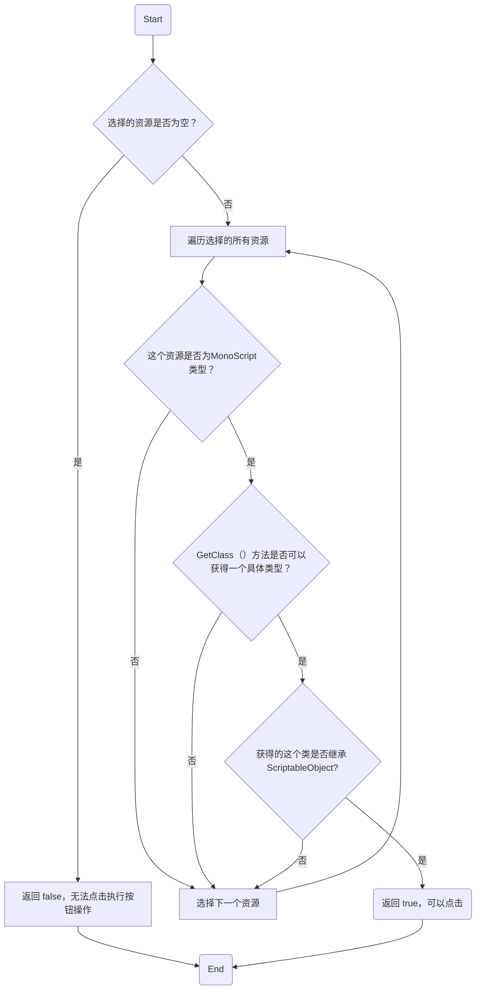
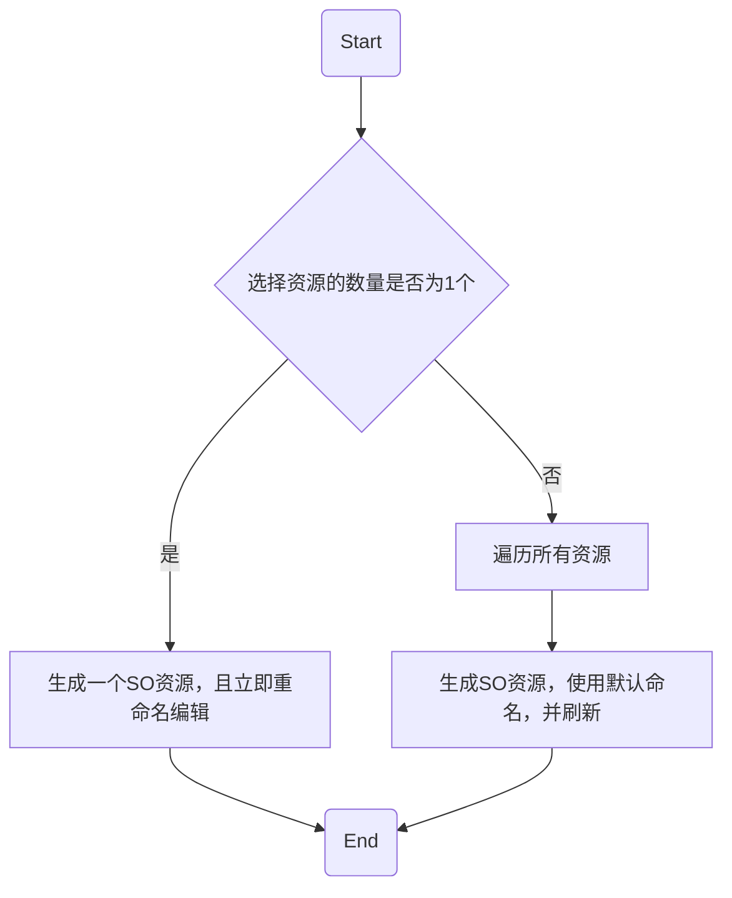

# QuickGenerateSO

## 用法

  1. 选择继承了 `ScriptableObject` 的脚本
  2. 右键选择 `Create SO Asset From Selected`
  3. 在当前目录生成一个 SO 资源

!!! tip "提示"

    1. 支持单选和多选。
         1. 单选 SO 脚本生成时可以立即设置文件名。
         2. 多选 SO 脚本生成时将直接生成资源文件，使用默认命名。
    2. 只有当选择的资源中包含有继承 `ScriptableObject` 的脚本文件时才可以点击 `Create SO Asset From Selected`。

!!! warning "限制"

    内部使用 `MonoScript.GetClass()` 方法获取 `Type` 值，此方法返回“主类”的 `Type` 值，要求是 `public`，且和文件名相同的类，因此使用时最好一个脚本文件中只包含一个继承 `ScriptableObject` 的类。

## 流程图

### 验证是否可以点击执行按钮操作

### 生成 SO 资源

